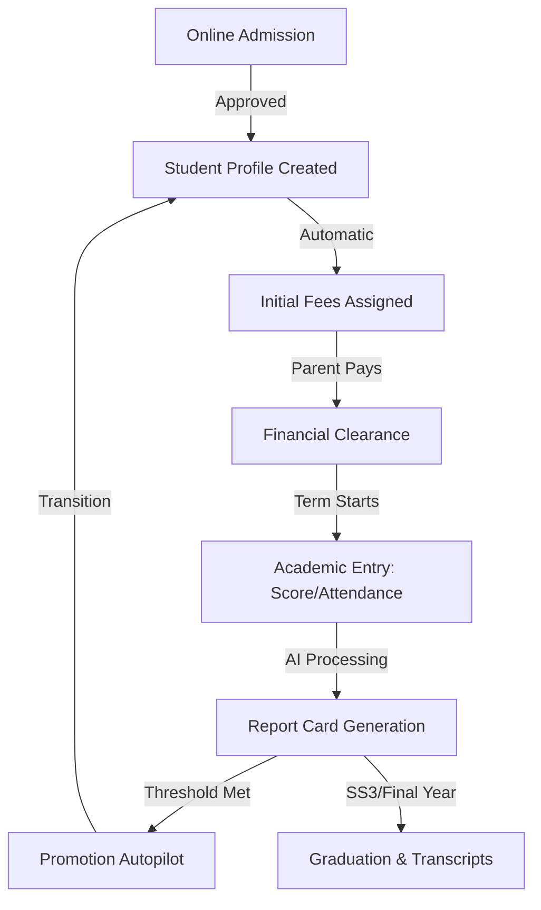

# Registra: The High-Tech School Management Ecosystem
**Comprehensive Product Documentation & Strategic Usage Guide**

---

## 1. Executive Summary & Philosophy

In the rapidly evolving academic landscape, traditional administrative burdens often detract from the core mission of education. **Registra** is not just a management system; it is a high-performance ecosystem designed to bridge the gap between complex school operations and educational excellence.

Built on the pillars of **Automation, Data-Driven Insights, and Seamless Communication**, Registra empowers schools to transition from reactive management to proactive leadership. By integrating cutting-edge AI with a robust multi-tenant architecture, we provide a unified platform that serves Administrators, Teachers, Students, and Parents with equal precision.

---

## 2. Architecture & Technology Stack

Registra is engineered for speed, scalability, and security, utilizing a modern decoupled architecture.

*   **Frontend**: Built with **Next.js 16** and **React**, providing a lightning-fast, single-page application experience. The UI is fully responsive, ensuring accessibility across desktops, tablets, and smartphones.
*   **Backend**: Powered by **Django 6** and **Django REST Framework**. Our backend features a sophisticated **Multi-Tenant Isolation** layer, guaranteeing that every school’s data remains strictly private and secure on its own logical instance.
*   **AI Engine**: A deep integration with **Google Gemini (via Vertex AI or OpenRouter)**. This "Academic Intelligence" layer handles everything from automated report card remarks to predictive student performance modeling.
*   **Infrastructure**: Persistent data storage via **PostgreSQL**, real-time background processing with **Celery/Redis**, and secure media handling via **AWS S3/Cloudflare R2**.

---

## 3. Module-by-Module Breakdown (Part A: Administration & Academic)

### A. School Administration & Tenant Center
*   **Purpose**: The central nervous system for platform configuration.
*   **Workflow**: Administrators set up school-wide parameters (sessions, terms, branding) and manage modular access.
*   **Key Features**: Custom subdomain management, Dynamic CMS for the school's public landing page, and Role-Based Access Control (RBAC).
*   **Benefits**: Full branding control and the ability to scale operations without additional technical overhead.

### B. Academic Management (The Core)
*   **Purpose**: To manage the end-to-end academic journey of every student.
*   **Workflow**: From student enrollment to the automated "Promotion Autopilot" at the end of the session.
*   **Key Features**:
    *   **Student 360**: Unified profile tracking attendance, conduct, and performance.
    *   **Nigerian Curriculum Streams**: Native support for Nursery, Primary, JSS, and SSS streams (Science, Art, Commerce) with individual student subject mapping.
    *   **Promotion Autopilot**: Rules-based engine that moves students to the next class based on performance thresholds.
    *   **Timetable Magic**: AI-driven scheduler that builds conflict-free weekly timetables in seconds.
*   **Benefits**: Reduces end-of-term administrative stress by 80% through automated data aggregation.

### C. Financial Center (Bursary & Payroll)
*   **Purpose**: To ensure the financial health and transparency of the institution.
*   **Workflow**: Fees are assigned based on class; parents pay via integrated gateways (Paystack), and payments automatically update student financial status.
*   **Key Features**:
    *   **Automated Fee Assignment**: Bulk assign tuition, transport, or uniform fees.
    *   **Staff Payroll**: One-click payroll generation with automated allowance and deduction calculations.
    *   **Expense Tracking**: Real-time tracking of school expenditure vs. revenue.
*   **Benefits**: Eliminates manual reconciliation errors and provides a real-time "Net Balance" view for school owners.

---
### D. Learning Center (LMS)
*   **Purpose**: To provide a centralized digital classroom for resources and assignments.
*   **Workflow**: Teachers upload materials (videos, PDFs, images) and create assignments; students access them through their personalized portal.
*   **Key Features**: Multimedia support (AWS S3/R2 integration), Automated submission tracking, and Rich-text lesson notes.
*   **Benefits**: Ensures that learning continues beyond the classroom walls, providing a "single source of truth" for all academic materials.

### E. Computer-Based Testing (CBT)
*   **Purpose**: To modernize examination processes and reduce grading lead times.
*   **Workflow**: Teachers create question banks (MCQ or Theory); students take timed exams; MCQs are auto-graded while Theory answers are sent to the AI evaluation engine.
*   **Key Features**: **AI-Assisted Theory Grading** (uses Gemini to evaluate student answers against rubrics), Timed sessions, and instant result generation.
*   **Benefits**: Eliminates manual grading bias and provides students with immediate feedback on performance.

### F. Communication & Engagement (CRM)
*   **Purpose**: To bridge the gap between the school, staff, and parents.
*   **Workflow**: Internal announcements are broadcasted; parents receive automated newsletters; support tickets are managed by the admin team.
*   **Key Features**: Automated Newsletter Generator, Support Ticketing System, and Instant Broadcasts.
*   **Benefits**: Boosts parent confidence through transparency and provides a professional channel for resolving grievances.

---

## 4. User-Specific Usage Guides

### For School Administrators (The Captain)
1.  **Morning Check**: View the Dashboard for real-time revenue vs. expense stats and "At-Risk" student alerts.
2.  **Strategic Oversight**: Use **Executive AI Insights** to identify subject trends across classes and adjust curricula accordingly.
3.  **Governance**: Approve payroll runs and review admission requests in the intake pipeline.

### For Teachers (The Mentor)
1.  **Preparation**: Use the **AI Lesson Planner** to generate structured curricula and suggested class activities.
2.  **Academic Entry**: Bulk upload attendance and subject scores; let the **AI Remark Engine** draft personalized student comments.
3.  **LMS Management**: Upload video lessons for students to review as homework or revision material.

### For Students (The Learner)
1.  **Daily Roadmap**: Check the personalized **Class Timetable** and upcoming **Deadlines**.
2.  **Assessment**: Take CBT quizzes and view instant feedback on MCQ submissions.
3.  **Resource Access**: Download lesson notes and re-watch lecture videos directly from the Learning Center.

### For Parents (The Partner)
1.  **Financial Clarity**: Access the **Bursary Portal** to see fee statements and pay tuition with a single click.
2.  **Transparency**: View updated **Report Cards** and teacher remarks immediately upon publication.
3.  **Engagement**: Read the school newsletter and submit support tickets for any administrative queries.

---
## 5. Business & Marketing Perspective

### Unique Selling Points (USPs)
1.  **Academic Intelligence (AI)**: Registra is not just a database; it’s an assistant. Automated remarks, AI-graded theory, and predictive insights set us apart from legacy systems.
2.  **Zero-Conflict Scheduling**: Our AI Timetable engine eliminates the manual headache of staff scheduling, saving hours of administrative labor.
3.  **Financial Integrity**: Multi-level payment verification and automated staff payroll ensure that the school’s "books" are always in balance.

### Value Proposition
*   **Private Schools**: Focus on **Parent Retention** through transparency and the "Wow Factor" of high-tech results and mobile-accessible fee payment.
*   **Public/Large Scale Institutions**: Focus on **Operational Efficiency** and data isolation at scale.

### Revenue Positioning
Schools should invest in Registra because it pays for itself in:
1.  **Reduced Overhead**: 50% less time spent on end-of-term processing.
2.  **Debt Recovery**: Automated fee reminders and easy online payment reduce outstanding tuition by up to 30%.
3.  **Data Security**: Protects against student record loss and fraudulent financial entries.

---

## 6. Operational Workflow Explanation

The power of Registra lies in its **Interconnected Lifecycle**:

*   **Admission to Finance**: As soon as an admission is approved, the system references the `AdmissionPackage` to assign initial fees, necessitating no manual entry.
*   **Academic to Promotion**: Scores entered by teachers flow into the `PromotionAutopilot`. If a student meets the threshold, they are automatically transitioned to the `next_class` for the new session, keeping historical data intact in `StudentHistory`.

---

## 7. Onboarding & Adoption Guide

### Step 1: Branding & Identity
*   Upload school logo and signature of the Head of School.
*   Customize the **Landing Page CMS** to reflect the school’s mission and core values.

### Step 2: Faculty Onboarding
*   Assign roles (Teacher, Admin, Staff).
*   Conduct training on the **AI Assistant Suite** to ensure buy-in and reduce initial teacher resistance.

### Step 3: Data Migration
*   Bulk import student and staff records.
*   Setup **Grading Schemes** and **Fee Categories**.

### Step 4: Go-Live
*   Broadcast the login URLs (subdomains) to parents.
*   Monitor support tickets in the first week for smooth adoption.

---

## Conclusion

Registra represents the pinnacle of modern EdTech. By combining the power of Next.js, Django, and Gemini AI, we provide a platform that is as technologically sophisticated as it is user-friendly. Whether you are scaling a single private academy or managing a diverse chain of institutions, Registra provides the tools to lead with data and educate with purpose.

---
**Document Status**: Final Version
**Audience**: Internal/External Stakeholders
